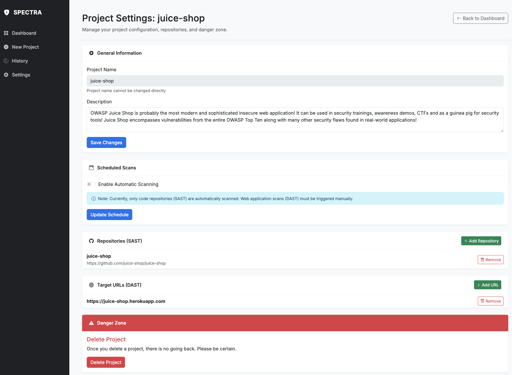

# Project Settings & Automation

Once a project is established, you can refine its scope and automate your security posture via the **Project Settings** page.

## 1. General Information

*   **Project Name**: The unique identifier for your audit.
    > **Note**: The project name is fixed upon creation to maintain data integrity across scan histories.
*   **Description**: You can update the project's scope or context at any time to reflect changes in the audit objectives.

<figure markdown="span">
{ width="400" }
<figcaption>Project Settings</figcaption>
</figure>

## 2. Assets Management (SAST & DAST)

Spectra allows you to dynamically scale the scope of your project:

### Repositories (SAST)
Manage your GitHub repository URLs.

*   **Add**: Click **"+ Add Repository"** to include a new microservice or module in the next scan.
*   **Remove**: Use the **"Remove"** button to exclude legacy code or out-of-scope repos.

### Target URLs (DAST)
Manage the live environments associated with your project.

*   **Add**: Click **"+ Add URL"** to include new staging or production endpoints.
*   **Remove**: Delete URLs that are no longer active or relevant for dynamic testing.

## 3. Scheduled Scans (Automation)

Spectra features a built-in scheduler to ensure your code is consistently monitored for new vulnerabilities.

*   **Enable Automatic Scanning**: Toggle this switch to activate recurring audits.
*   **Frequency & Time**: Choose a **Daily** or **Weekly** interval and set the specific execution time.

!!! warning "Technical Limitation"
    Currently, only code repositories (**SAST**) are automatically scanned.
    Because dynamic analysis (**DAST**) interacts with live environments and can impact performance or generate logs, DAST scans **must be triggered manually** to ensure the environment is ready for testing.

## 4. Danger Zone

*   **Delete Project**: This action is **irreversible**. It will permanently remove the project configuration and all associated scan history from your local Spectra instance.
